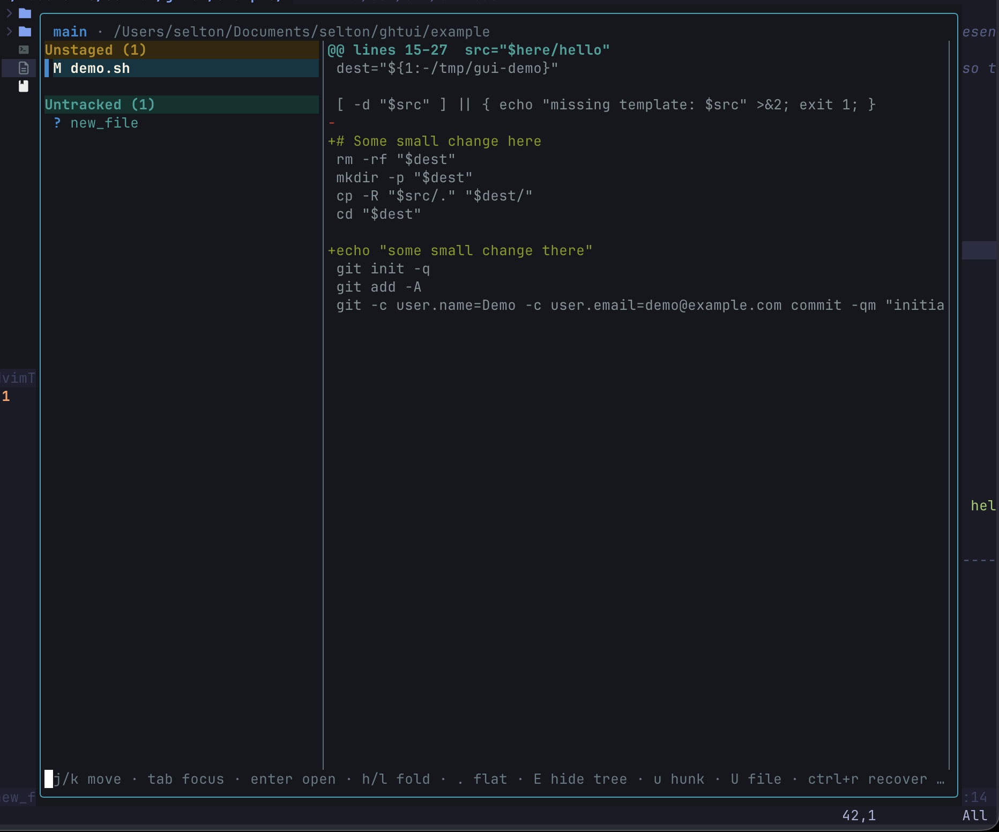

# gui — Git TUI

A keyboard-driven terminal UI for local Git workflows: view diffs, stage/unstage,
discard changes, and manage branches — aiming for parity with the VS Code / Cursor
**Source Control** experience for day-to-day work in the current repository.

Built with [Bubble Tea](https://github.com/charmbracelet/bubbletea). It shells out
to the `git` CLI for every operation (no Git protocol reimplementation) and does
**not** talk to GitHub/GitLab or any remote host.

## Layout



- **Header** shows the current branch, ahead/behind vs. upstream (when configured),
  the `origin` identity (`owner/repo` or host) when a remote exists, and the repo path.
- **File list** groups changes into **Staged**, **Unstaged**, and **Untracked**, with
  status glyphs `A`/`M`/`D`/`R`/`?`/`C`/`U`. Renames render as `orig → new`.
  Within each group, files are shown as a **folder tree**: single-child directory
  chains are **compacted** onto one line (`internal/ui/diffview/`), folders can be
  **collapsed/expanded** (`h`/`l`/`Enter`, or click), and `.` toggles a **flat**
  view of full relative paths. Long names wrap to stay readable; the list scrolls
  to keep the selection visible.
- **Diff pane** shows the unified diff of the selected file (`+` green, `−` red,
  `@@` cyan) in a scrollable viewport.
- A clean tree shows a friendly *"nothing to commit, working tree clean"* message.

## Install / run

**Download a release** — prebuilt binaries for Linux / macOS / Windows
(amd64 + arm64) are on the [Releases page](../../releases). Grab the archive for
your platform, extract, and put `gui` on your `PATH`. For example on macOS arm64:

```sh
VER=0.1.0   # see the Releases page for the latest
curl -sSL -o gui.tar.gz \
  https://github.com/seltonfiuza/gui/releases/download/v${VER}/gui_${VER}_darwin_arm64.tar.gz
tar -xzf gui.tar.gz
sudo mv gui /usr/local/bin/   # or any dir on your PATH
gui --version
```

**From source:**

```sh
go install github.com/seltonfiuza/gui@latest   # puts `gui` in $(go env GOPATH)/bin
# or, in a clone:
go build -o gui . && ./gui
```

Or run without installing: `go run .`

On launch it detects the repository root (`git rev-parse --show-toplevel`) and
opens straight into the diff view for the current working tree — no subcommand
needed. If you are not inside a git repository it prints a clear message and exits.
`gui --version` prints the build version.

Releases are cut automatically by [GoReleaser](https://goreleaser.com): pushing a
`vX.Y.Z` tag builds the cross-platform archives, checksums, and changelog and
publishes the GitHub Release (see [`.github/workflows/release.yml`](.github/workflows/release.yml)).

## Neovim integration (`:Gui`)

A small Neovim plugin lives in [`contrib/nvim`](contrib/nvim) that opens the TUI
in a floating terminal with `:Gui` (the same pattern as `lazygit.nvim`). Build the
binary onto your `PATH` first (`go install .`), then with **lazy.nvim**:

```lua
{
  "seltonfiuza/gui",
  build = "go install .",
  cmd = "Gui",
  keys = { { "<leader>gg", "<cmd>Gui<cr>", desc = "gui git TUI" } },
  config = function()
    vim.opt.runtimepath:append(vim.fn.stdpath("data") .. "/lazy/gui/contrib/nvim")
    require("gui").setup()
  end,
}
```

`:Gui` opens the TUI in a centered float; `q` closes it and refreshes your
buffers. See [`contrib/nvim/README.md`](contrib/nvim/README.md) for manual
installation and configuration options.

## Keymap

Leader key defaults to **`Space`**.

| Binding            | Action                                                   |
|--------------------|----------------------------------------------------------|
| `j` / `↓`          | Move down — file selection (list focus) or **diff line cursor** (diff focus) |
| `k` / `↑`          | Move up — file selection or diff line cursor             |
| `Tab`              | Move focus between the **file tree** and the **diff contents** |
| `Enter`            | On a file: focus the diff pane (j/k then move by line). On a folder: collapse/expand it |
| `h` / `←`          | Collapse the folder under the cursor, or jump to its parent |
| `l` / `→`          | Expand the folder under the cursor, or step into it       |
| `.`                | Toggle **folder tree** ↔ **flat** (full-path) file list   |
| `Shift+E`          | Hide / show the file-tree pane (diff takes the full width) |
| `Esc`              | Return focus to the file list / close an overlay         |
| `}` / `{`          | Jump to the next / previous hunk in the diff             |
| `s`                | Stage or unstage the selected file                       |
| `a` / `Shift+A`    | Stage all changed + untracked files / unstage all staged files |
| `Shift+C`          | Commit staged changes (opens a commit-message dialog)    |
| `u`                | Discard the **hunk under the cursor** (unstaged: reverse-apply; staged: unstage the hunk) |
| `U`                | Discard the **whole file** (always confirms; `git restore` / `git clean` for untracked) |
| `Ctrl+R`           | Recover the most recently discarded change (LIFO undo stack) |
| `>` / `<`          | Grow / shrink the diff pane (resize the list ↔ diff split) |
| `r`                | Refresh Git status (force an immediate reload)           |
| `Ctrl+T`           | Toggle background auto-refresh on/off                    |
| `Ctrl+G`           | Toggle the **raw** (unfiltered) diff vs. the cleaned view |
| `Shift+B`          | Open the branch panel                                    |
| `Shift+T`          | Open the **theme picker** (live preview)                 |
| `?`                | Toggle the help / keymap overlay                         |
| `q`                | Quit (warns if a git operation is in progress)           |
| `Ctrl+C`           | Quit immediately                                         |

`u` discards only the hunk the diff cursor sits in, leaving the file's other
changes intact; on an untracked file it falls back to the whole-file path. `U`
always shows a confirmation naming the file. `Ctrl+R` re-applies the last
discarded change — the undo stack is in-memory (capped at 50, lost on quit). The
file list / diff split is resizable with `>` / `<` and clamps to minimum pane
widths so nothing clips in narrow terminals.

### Auto-refresh

The interface reloads itself **near real time** — changes made on disk, by
external `git` commands, or by branch switches show up without pressing `r`. A
background poll runs every ~750 ms and re-reads `git status` off the UI thread;
the next poll is chained off the previous one's completion, so a slow status
never overlaps or queues itself.

The refresh is non-disruptive:

- It only re-renders when the status **actually changed** (a cheap fingerprint of
  branch / upstream / ahead-behind / each file's path+code is compared) — an
  idle repo causes no redraw and no diff re-fetch.
- The **selected file stays selected by path**; if it disappears the selection
  falls to a sensible neighbor.
- The **diff line cursor and scroll position are preserved** while the selected
  file's diff is unchanged, and reset only when that file's content actually
  changed.
- Active focus (list vs. diff) is left alone, and an open overlay (branch / help /
  confirm) or an in-progress text prompt is **never** closed, refocused, or
  interrupted — the data refreshes underneath and the view reconciles once the
  overlay closes.
- A background status failure is surfaced as a toast **at most once** (not on
  every tick).

Auto-refresh is **on by default**. Press **`Ctrl+T`** to toggle it off (useful on
very large repos) and on again; the footer shows `auto:on` / `auto:off`. Manual
`r` always forces an immediate reload regardless of the toggle.

### Clean diff view

The diff pane renders a **focused, cleaned diff** rather than raw `git diff`
plumbing. By default it suppresses `diff --git …`, `index <sha>..<sha> <mode>`,
`new file mode` / `deleted file mode`, `similarity` / `rename` lines, and the
redundant `--- a/…` / `+++ b/…` file header. Hunk headers are shown as a compact
label (`@@ lines X–Y  <context>`), added/removed lines are tinted with a clear
`+` / `-` marker column, and context lines are dimmed so changes pop. Untracked
files (rendered via `git diff --no-index`) get the same treatment — no
`/dev/null` noise leaks through.

The cleanup is a **render-time transform only**: hunk operations (`u` discard,
`}` / `{` navigation) still run against the raw diff, with an internal line-index
map keeping the cursor, hunk jumps, and discards byte-exact. Press **`Ctrl+G`**
to toggle the full raw diff for debugging.

### Themes (`Shift+T`)

A curated set of named themes, each a fully-populated color **palette** that is
the single source of truth for every style the UI draws (header, group headers,
status glyphs, selection, diff add/remove/context/hunk, overlays, footer, toasts):

- **Tokyo Night** (default), **Catppuccin**, **Gruvbox**, **Nord**, **Solarized**,
  and a high-contrast **mono** fallback for 16-color / monochrome terminals.

Press **`Shift+T`** to open the picker. Moving the selection (`j` / `k`)
re-renders the **whole UI in that theme immediately** (live preview); `Enter`
confirms and persists the choice, `Esc` reverts to the theme that was active when
the picker opened. The selected theme is saved to the config file (`theme` key)
and restored on the next launch. Truecolor values are downsampled automatically to
the terminal's 256/16-color profile.

### Branch panel (`Shift+B`)

A modal overlay listing **Local** branches (current marked `*`) and
**Remote-tracking** branches.

| Binding        | Action                                                       |
|----------------|--------------------------------------------------------------|
| `j` / `k`      | Navigate branches                                            |
| `Enter` / `c`  | Checkout the selected branch                                 |
| `n`            | Create a branch (prompts for a name, from the selected ref)  |
| `d`            | Delete the selected local branch (escalates to force if unmerged) |
| `R`            | Rebase the current branch onto the selected branch           |
| `Esc`          | Close the panel                                              |

Delete (when unmerged) and rebase require explicit confirmation. Rebase
conflicts surface an inline message; resolve them with the `git` CLI.

## Development

```sh
go build ./...     # build everything
go vet ./...       # static checks
go test ./...      # unit tests (git parsing/mutations, keymap dispatch, UI transitions)
```

`internal/git` tests run against hermetic temp fixture repos and skip if `git`
is not on `PATH`. **Platform:** developed and verified on macOS; the code is
portable Go and intended to build on Linux.

